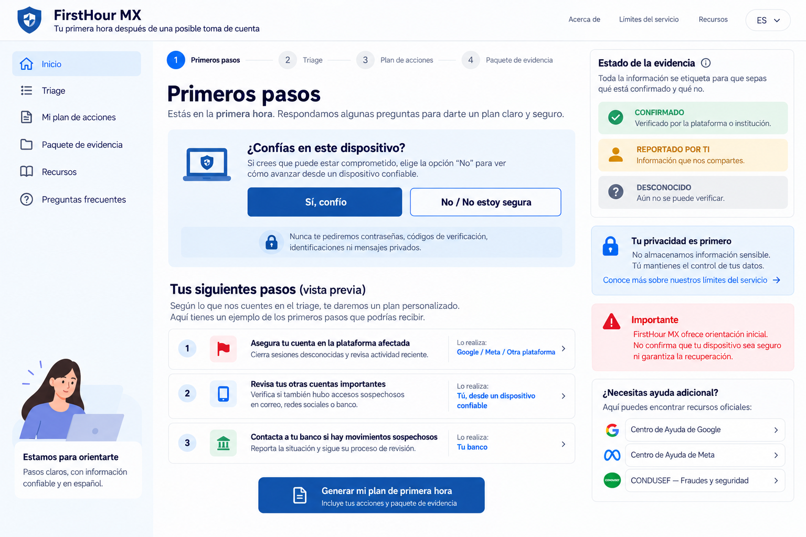
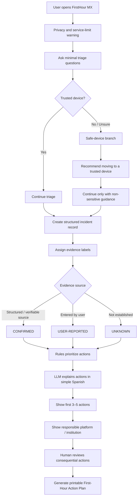
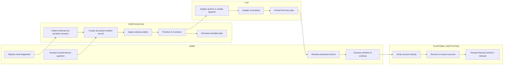
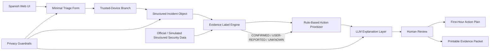

# FirstHour MX — BUSINESS BENDING · WEEK 8

## WHEN THE TOOLS OUTRUN THE SAFEGUARDS

**Role:** TECHNOLOGIST
**Student:** Monica
**Primary Vacuum:** BREACH-VICTIM SERVICE
**Prototype:** FirstHour MX
**Build focus:** Triage with evidence labels and a safe-device branch

---

# 1. Problem in my words

When someone notices a possible account takeover or impersonation, the first hour is confusing.

The victim may not know what actually happened, whether the device they are using can be trusted, what action should come first, or which company or institution can actually help.

Searching online often produces too many generic security recommendations at the moment when the person needs a small number of clear actions.

FirstHour MX does **not** try to detect every breach, scan a device, or recover an account automatically.

Instead, it turns a small amount of non-sensitive information into a first-hour response plan. It separates what is known from what the user only reports or suspects, checks whether the current device should be treated as trusted, and routes the person toward the platform or institution that can actually perform the recovery action.

The goal is not:

> “We solved your breach.”

The goal is:

> “Here is what we know, what we do not know, and what you should do first.”

---

# 2. Exact user

## Primary user

A Spanish-speaking person in Mexico who has just noticed signs of possible account takeover or impersonation and does not know what to do first.

Examples:

* An unfamiliar login or security alert appeared.
* Someone may be using their identity online.
* Their account settings changed unexpectedly.
* Contacts report receiving messages that the user did not send.
* The user suspects unauthorized access but does not yet know the extent of the incident.

## User state

The person may be:

* stressed,
* uncertain about what happened,
* using the same device involved in the incident,
* unsure which evidence matters,
* and unfamiliar with cybersecurity terminology.

Therefore, FirstHour MX must use short Spanish instructions and cannot depend on the user understanding technical security concepts.

## Information FirstHour MX may ask

Only low-risk structured questions such as:

* What type of account is affected?
* What did you notice?
* Can you still access the account?
* Do you trust the device you are currently using?
* Did you notice an unfamiliar login, message, setting change, or transaction?
* Is money or a financial account potentially involved?

## Information FirstHour MX must NEVER request

* Passwords
* Verification or MFA codes
* Government IDs
* Banking credentials
* Private messages
* Recovery codes
* Victim or contact lists

---

# 3. Success definition

**Before the module closes, FirstHour MX works as a browser-based prototype that asks a small set of Spanish triage questions, branches when the current device should not be trusted, labels information as CONFIRMADO / REPORTADO POR TI / DESCONOCIDO, generates the first 3–5 prioritized actions with the responsible institution or platform, and creates a printable First-Hour Action Plan / Evidence Packet without collecting secrets or claiming that recovery is complete.**

A successful demo must show:

1. A user completing triage.
2. The trusted-device decision changing the path.
3. Evidence labels appearing correctly.
4. A prioritized list of 3–5 actions.
5. The responsible actor for every consequential action.
6. A printable First-Hour Action Plan.
7. Visible service limitations.
8. No automatic consequential actions.

---

# 4. Image-generated mockup

The official FirstHour MX mockup was generated before coding and represents the main first-hour triage dashboard.



## Mockup purpose

The screen is designed for a stressed, non-technical Spanish-speaking user who has reported a possible account takeover.

The interface intentionally prioritizes one important decision:

> **¿Confías en este dispositivo?**

The user receives two clear options:

* **Sí, confío**
* **No / No estoy segura**

If the user selects **No / No estoy segura**, FirstHour MX activates the safe-device path instead of encouraging sensitive recovery actions from the current device.

FirstHour MX does **not** claim that it can technically verify that a device is clean.

## Privacy message

The interface clearly states:

> **Nunca te pediremos contraseñas, códigos de verificación, identificaciones ni mensajes privados.**

## Evidence labels

The interface uses three evidence states:

### CONFIRMADO

Information supported by an approved structured or verifiable source available to the prototype.

### REPORTADO POR TI

Information entered or selected by the user. It has not been independently verified.

### DESCONOCIDO

FirstHour MX does not currently have enough evidence to establish the statement.

### Evidence rule

The LLM cannot promote **REPORTADO POR TI** or **DESCONOCIDO** information to **CONFIRMADO**.

The evidence state must come from the structured evidence layer, not from AI inference.

## Visible service disclaimer

> **FirstHour MX ofrece orientación inicial. No confirma que tu dispositivo sea seguro ni garantiza la recuperación.**

---

# 5. Mermaid flowchart + swimlane

## A. Main user flow



## B. Swimlane



## Authority boundary

FirstHour MX can:

* organize information,
* label evidence,
* prioritize actions,
* explain next steps,
* route the user,
* and generate a plan.

FirstHour MX cannot:

* verify that a device is clean,
* prove the complete extent of a compromise,
* recover an external account,
* freeze money,
* change passwords,
* terminate external sessions,
* contact institutions automatically,
* or guarantee recovery.

Those actions remain with the user and the relevant platform or institution.

---

# 6. Global benchmark line

**Global benchmark:** FirstHour MX adapts established incident-response principles—triage, evidence provenance, uncertainty, response, and recovery routing—into a lightweight Spanish first-hour consumer workflow rather than attempting to replace the security and recovery systems of banks or digital platforms.

Current incident-response practice supports separating evidence, analysis, response, and recovery. Major digital platforms also retain authority over their own account-recovery and security mechanisms.

FirstHour MX therefore follows one central benchmark principle:

> **FirstHour MX is the coordination layer, not the authority layer.**

It helps the victim understand what to do next while leaving account verification, recovery, financial intervention, and other consequential actions with the institution that can actually perform them.

---

# 7. Three-sentence long view

Today, FirstHour MX can realistically organize user-reported signals, structured incident information, uncertainty labels, and official recovery paths into a useful first-hour response.

Over time, verified platform signals and standardized incident data could make the guidance more contextual without requiring FirstHour MX to collect highly sensitive information.

The long-term opportunity is not an AI that magically detects every hack, but a trusted response layer that helps ordinary people move from panic and uncertainty to evidence-based action while preserving human and institutional authority.

---

# 8. Scope cut

## BUILD NOW

* Spanish-first web interface.
* 5–7 simple triage questions.
* Trusted-device decision.
* Safe-device alternative.
* Structured incident object.
* Three evidence states:

  * CONFIRMADO
  * REPORTADO POR TI
  * DESCONOCIDO
* Rule-based action prioritization.
* LLM explanation of approved actions.
* 3–5 first-hour actions.
* Responsible actor shown for every action.
* Human approval before consequential actions.
* Printable First-Hour Action Plan / Evidence Packet.
* Clearly labeled simulated security data or AI output.
* Visible privacy and service limits.

## DO NOT BUILD

* Antivirus.
* Password manager.
* Malware scanner.
* Device-forensics system.
* Fake breach-detection engine.
* Automatic account recovery.
* Automatic password changes.
* Automatic session termination.
* Bank transactions.
* Automatic fraud reports.
* ID upload.
* Password collection.
* Verification-code collection.
* Private-message upload.
* Victim/contact-list upload.
* Claims that a device is safe.
* Claims that exposure has been fully identified.
* Cybersecurity scores.
* Guaranteed freeze, refund, or recovery.
* Assumed partnerships with banks, government agencies, or platforms.

## Core scope rule

> **If a feature requires FirstHour MX to pretend that it knows something it cannot verify, cut it.**

---

# 9. Architecture + Dragon Stack

## Architecture



## Stack table

| Layer             | Technology                                                                  | Purpose                                              | Safety boundary                                  |
| ----------------- | --------------------------------------------------------------------------- | ---------------------------------------------------- | ------------------------------------------------ |
| Interface         | Next.js / React                                                             | Spanish triage experience                            | Never asks for secrets                           |
| Structured triage | Local structured data / JSON                                                | Represent incident answers consistently              | Minimal data only                                |
| Security tooling  | Rule-based incident/evidence engine + structured or simulated security data | Classify evidence provenance and route incident type | Does not claim to scan or verify the device      |
| LLM               | LLM API                                                                     | Explain approved actions in simple Spanish           | Cannot invent evidence or change evidence labels |
| Automation        | First-Hour Plan generator                                                   | Convert triage into an ordered response plan         | Generates instructions only                      |
| Safe-device logic | Deterministic branching                                                     | Route users away from questionable devices           | Does not claim a device is clean                 |
| Evidence layer    | Provenance labels                                                           | Separate known, reported, and unknown information    | CONFIRMED requires approved evidence             |
| Output            | Browser print / printable document                                          | Produce First-Hour Action Plan / Evidence Packet     | User reviews before using                        |
| External recovery | Official platform/institution                                               | Performs actual account or financial action          | Outside FirstHour MX                             |

---

# DRAGON STACK

The prototype satisfies the Week 8 stack floor with:

**LLM + security tooling / structured security data + automation**

## Dragon 1 — LLM

The LLM is used for:

* explaining approved actions in simple Spanish,
* translating technical security instructions into understandable language,
* explaining uncertainty,
* and formatting the final First-Hour Action Plan.

### LLM boundary

The LLM is **not the evidence authority**.

It cannot:

* declare that an account was hacked,
* declare that a device is safe,
* create new evidence,
* change an evidence label,
* guarantee recovery,
* or perform consequential external actions.

---

## Dragon 2 — Security tooling / structured incident data

A deterministic evidence and incident-routing layer processes structured signals.

Example conceptual incident record:

```text
Incident type: possible account takeover
Current access: available
Trusted device: unknown
Unknown login: user reported
Financial impact: unknown
```

The evidence engine—not the LLM—assigns the permitted evidence state.

Possible outputs are:

```text
CONFIRMED
USER-REPORTED
UNKNOWN
```

If the prototype uses simulated security signals or structured breach data, they must display:

> **SIMULATED FOR PROTOTYPE**

Simulated data cannot be presented as real evidence about the user.

---

## Dragon 3 — Automation

After triage, FirstHour MX automatically assembles:

* incident summary,
* evidence labels,
* first 3–5 actions,
* responsible actor for each action,
* unresolved questions,
* and a next-step evidence checklist.

Automation stops before any consequential external action.

FirstHour MX can generate the instructions.

It cannot execute the recovery.

---

# Human approval gate

Before:

* contacting a bank,
* reporting an account,
* changing account access,
* sending a report,
* or taking another consequential action,

the interface requires the user to review the recommendation and intentionally continue.

The prototype does not automatically send information or act on the user's behalf.

---

# 10. Test plan

Before any real pilot, FirstHour MX must pass three fictional cases.

The goal is not to prove that FirstHour MX can detect cyberattacks.

The goal is to prove that the system can respond to uncertainty **without inventing evidence or requesting secrets.**

---

## TEST 1 — Fictional account takeover

### Scenario

The fictional user reports:

* an unfamiliar login,
* messages they did not send,
* and uncertainty about the device they are currently using.

For:

> **¿Confías en este dispositivo?**

the user selects:

> **No / No estoy segura**

### Expected behavior

FirstHour MX must:

* activate the safe-device branch,
* avoid telling the user that the current device is compromised,
* label the unfamiliar login as REPORTADO POR TI unless a structured source verifies it,
* recommend continuing sensitive recovery from a trusted device,
* route account recovery to the affected platform,
* generate 3–5 prioritized actions,
* identify who can perform each action,
* and create a printable First-Hour Action Plan.

### Must NOT say

> “Your device has been hacked.”

> “We confirmed someone accessed your account.”

> “Your device is now safe.”

> “You are safe now.”

---

## TEST 2 — Fictional impersonation / fundraiser

### Scenario

Friends tell the fictional user that an account using their identity is asking people for money.

The user can still access their legitimate account.

### Expected behavior

FirstHour MX must:

* distinguish impersonation from confirmed account takeover,
* mark reports from friends as REPORTADO POR TI,
* keep actual account compromise DESCONOCIDO unless evidence establishes it,
* recommend platform reporting and preservation of non-sensitive evidence,
* identify the platform as the actor able to investigate or remove the impersonating account,
* and avoid claiming that the legitimate account was breached.

### Critical test

The system must understand:

> **Impersonation does not automatically mean account takeover.**

---

## TEST 3 — Uncertain exposure

### Scenario

The fictional user receives a suspicious security notification but cannot determine whether it is legitimate.

There are no other observed signs.

### Expected behavior

FirstHour MX must:

* keep compromise status DESCONOCIDO,
* avoid escalating uncertainty into a confirmed breach,
* recommend checking activity through the platform's official channel rather than through the suspicious notification,
* give a small number of reversible first steps,
* and clearly state what remains unknown.

### Critical test

Uncertainty must remain uncertainty.

The LLM cannot transform:

> “This might be suspicious.”

into:

> “Your account was compromised.”

---

# Acceptance checklist

The prototype passes only if all three test cases produce:

* [ ] Zero requested passwords.
* [ ] Zero requested verification codes.
* [ ] Zero requested government IDs.
* [ ] Zero requested private messages.
* [ ] Zero requested victim/contact lists.
* [ ] Zero unsupported CONFIRMADO labels.
* [ ] Zero “you are safe” claims.
* [ ] Zero guarantees of recovery, refund, freeze, or exposure.
* [ ] Correct trusted-device branching.
* [ ] Correct institution/platform routing.
* [ ] 3–5 prioritized first actions.
* [ ] Human approval before consequential actions.
* [ ] Clearly labeled simulated data.
* [ ] Printable First-Hour Action Plan.
* [ ] Visible service limits.

---

# 11. Blueprint conditions

## Condition 1 — Shadow Clause

No server uploads of:

* IDs,
* passwords,
* verification codes,
* private messages,
* or victim lists.

No:

* automatic sending,
* automatic access changes,
* or delegated financial actions.

---

## Condition 2 — Evidence and claims

All relevant statements must use one of three evidence states:

* **CONFIRMADO**
* **REPORTADO POR TI**
* **DESCONOCIDO**

FirstHour MX must never provide:

* “you are safe” claims,
* exposure guarantees,
* opaque cybersecurity scores,
* or invented evidence.

Consequential communications require human review.

---

## Condition 3 — Accessibility and routing

The product must:

* use short Spanish steps,
* provide printable output,
* provide a trusted-device alternative,
* clearly state the first recommended action,
* and identify the institution or platform that can actually perform the consequential action.

---

## Condition 4 — Realistic service limits

FirstHour MX must clearly publish what it cannot do.

There is:

* no guaranteed account recovery,
* no guaranteed freeze,
* no guaranteed refund,
* no guarantee that all exposure has been identified,
* and no promise of 24/7 human support.

---

## Condition 5 — Business assumptions

The prototype does not assume:

* partnerships with banks,
* partnerships with government institutions,
* partnerships with technology platforms,
* or willingness to pay.

The prototype must demonstrate value without depending on any of these assumptions.

---

## Condition 6 — Pre-pilot testing

Before any real pilot, FirstHour MX must test:

1. fictional account takeover,
2. fictional impersonation/fundraiser,
3. uncertain exposure.

Across all three cases there must be:

* zero unsupported claims,
* zero requested secrets,
* correct evidence labels,
* correct safe-device routing,
* and correct platform/institution routing.

---

# 12. Service limits shown to the user

> **FirstHour MX ofrece orientación inicial durante la primera hora.**

FirstHour MX does not verify that your device is free of compromise, guarantee that all exposure has been identified, recover accounts, freeze funds, guarantee refunds, or provide guaranteed 24/7 human support.

Information you provide is labeled **REPORTADO POR TI** unless it can be independently supported by an approved structured source.

When information cannot be established, FirstHour MX labels it **DESCONOCIDO**.

Consequential actions remain under human control and are performed by you or by the relevant platform, bank, institution, or authority.

---

# Final TECHNOLOGIST principle

> **The strongest technical feature of FirstHour MX is not pretending to know more.**

The prototype makes uncertainty visible.

It preserves the difference between verified evidence, user reports, and unknown information.

It routes the victim toward the institution that actually has authority.

And it automates only the part that can safely be automated:

> **turning a confusing first hour into a clear, prioritized, human-controlled action plan.**
